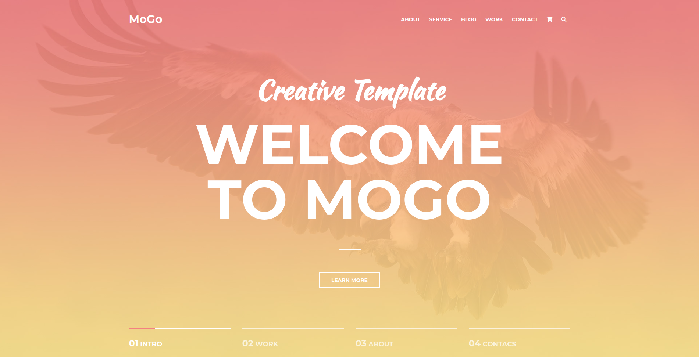
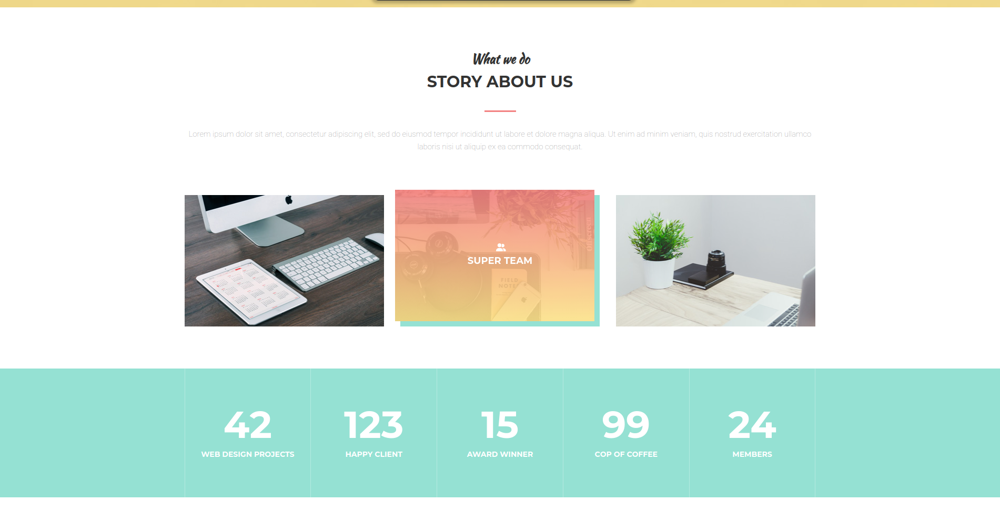
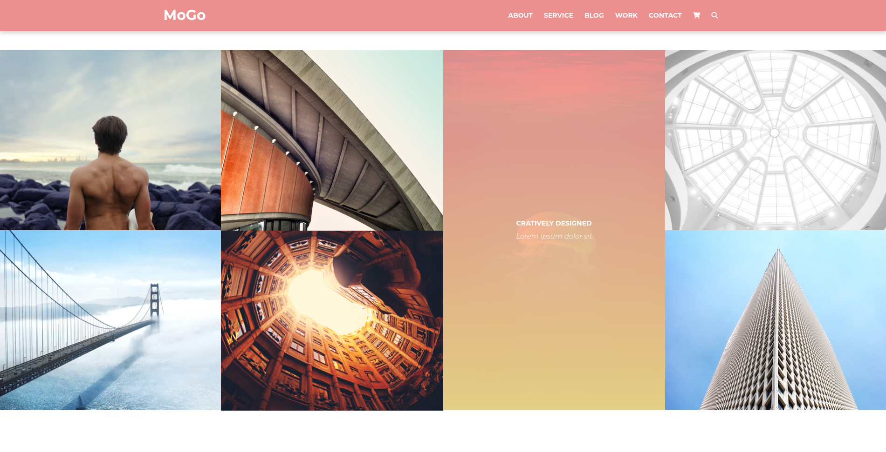
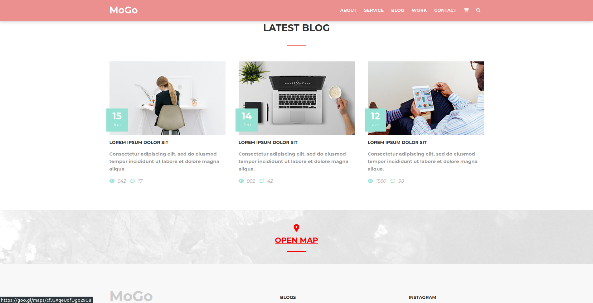

# Mongo Landing Page

This project is a simple landing page that uses HTML, CSS, JS, and MongoDB to create a fully responsive design. The project allows the user to submit their name and email address, and stores the data in a MongoDB database.

# Description

This landing page is designed to be fully responsive, meaning that it adapts to different screen sizes and devices. The page is built using HTML, CSS, and JS, and includes a form that allows the user to submit their name and email address.

# Installation

To run this project, simply download or clone the repository to your computer and open the index.html file in a web browser.

## git clone https://github.com/your-username/mongo-landing-page.git

# Screenshots

# Contributing

Contributions are welcome! If you would like to contribute to this project, please fork the repository and submit a pull request with your changes.
